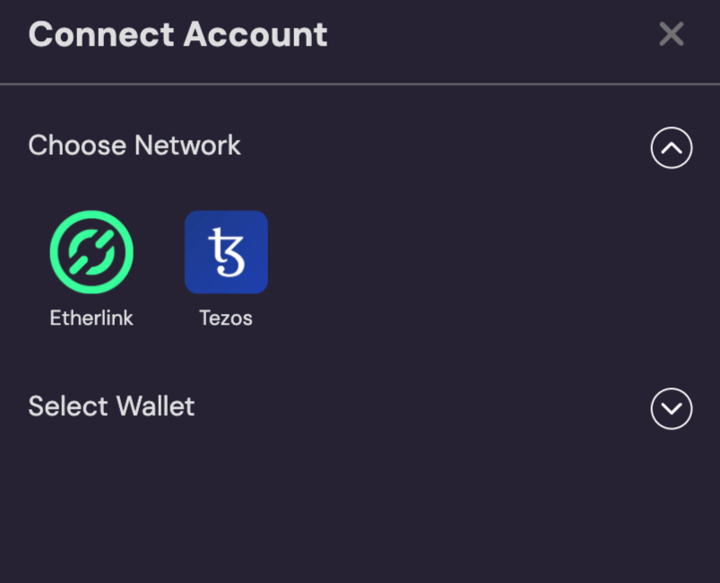
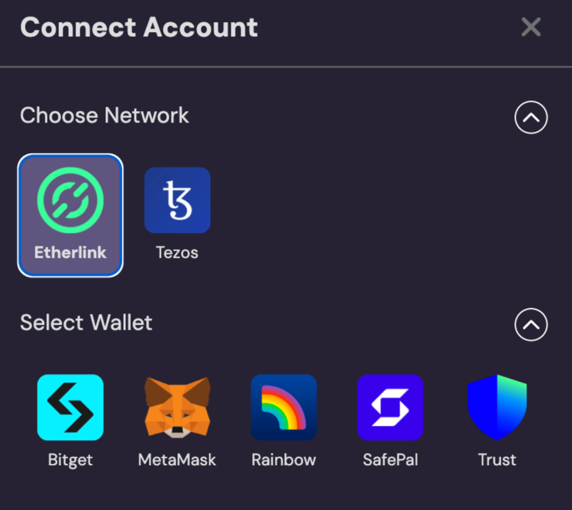
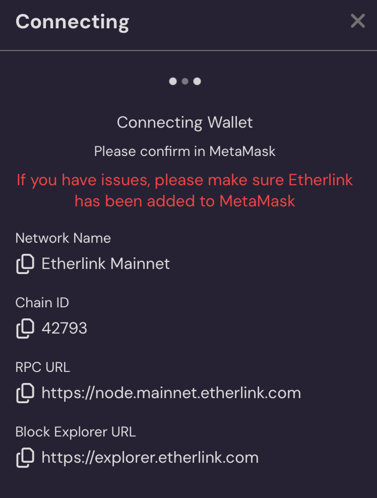
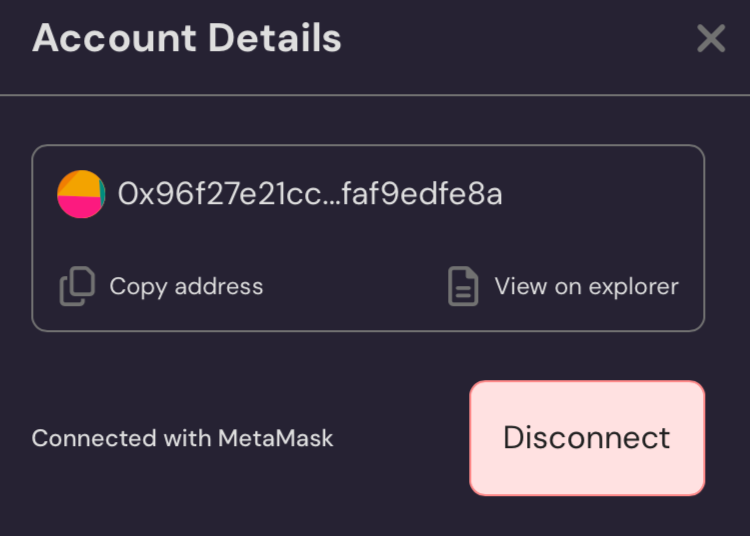

# React-Modal

### Wallet Connection React-Modal

**t:connect** provides a built-in Wallet Connection React-Modal, developed in React, that simplifies the process of connecting users via supported wallets to Tezos and Etherlink. Leveraging React Provider and Hook technology, this ready-to-use modal component facilitates state management and enables seamless integration into the component tree. Developers can easily embed it into their Telegram Mini App, allowing users to securely and effortlessly connect their wallets.

**Features of the Wallet Connection React-Modal**

* **User-Friendly Interface**: An intuitive UI that guides users through the wallet connection process.
* **Multi-Chain Support**: Supports both Tezos and Etherlink, offering flexibility for various applications.
* **Multiple Wallet Options**: Compatible with a range of wallets like Altme, MetaMask, Trust Wallet, and more.
* **Secure Authentication**: Ensures that user credentials and private keys remain secure during the connection.

### The TConnectModalProvider

The TConnectModalProvider has eight properties:

```typescript
// API-key to get access to our service
apiKey: string; 
```


Wondering how to obatin an api key? see: [Broken link](broken-reference "mention")


```typescript
// The URL used to establish a connection
bridgeUrl: string;
```


Note that the `bridgeUrl`parameter must always be set to `"https://tconnect.io"`, as this is the hosted location of the bridge.


```typescript
// Name of your application
appName: string;
```

```typescript
// The Url of your application
appUrl: string;
```

```typescript
// Optional URL for the application icon
appIcon?: string;
```

```typescript
// Optional array to specify which networks to filter or allow
// Default: etherlink and tezos 
networkFilter?: Array<'etherlink' | 'tezos'>;
```

```typescript
// Optional configuration for the Tezos Beacon network
// Default: Mainnet
tezosBeaconNetwork?: TezosBeaconNetwork;
```

```typescript
// Optional configuration for the Tezos WalletConnect network
// Default: Mainnet
tezosWcNetwork?: TezosWcNetwork;
```

### The TConnectModal Hook

```typescript
// function to open the modal
openModal: () => void;

// function to clode the modal
closeModal: () => void;

// the evm Provider
evmProvider: TConnectEvmProvider | undefined;

// the tezos-beacon Provider
tezosBeaconProvider: TConnectTezosBeaconProvider | undefined;

// the Tezos WalletConnect Provider
tezosWcProvider: TConnectTezosWcProvider | undefined;

// true if successfully connected
connected: boolean;
```

### How to use the Wallet Connection React-Modal



```typescript
npm install @tconnect.io/modal
```



#### Setup the React-Modal Provider

We recommend first providing the TConnectModalProvider, for example in `App.tsx.`&#x20;

```typescript
import { TConnectModalProvider } from "@tconnect.io/modal";
import { MyComponent } from "./MyComponent";

export default function App() {
  return (
    <TConnectModalProvider
      appName={"Example App"}
      appUrl={"https://your-domain.io"}
      bridgeUrl={"https://tconnect.io"}
      apiKey={"PRIVATE_API_KEY"}
    >
      <MyComponent />
    </TConnectModalProvider>
  );
}

```



#### Display the Wallet Connection React-Modal

Now, within the provider, in this example in the `App` component, the `openModal` method can be called to display the modal for wallet selection.

```typescript
import { useTConnectModal } from "@tconnect.io/modal";

export const MyComponent = () => {
  const tConnect = useTConnectModal();
  return <button onClick={tConnect.openModal}>open modal</button>;
};

```



### React-Modal Workflow



#### Blockchain  Selection

The modal first provides the option to choose the blockchain  to be used. The user can select between Tezos and Etherlink.





#### Wallet Selection

After selecting the Blockchain, the user is prompted to choose a wallet. The list of available wallets is automatically filtered based on the previously chosen blockchain.





#### Wallet Connection Execution

Once a wallet is selected, the user is redirected to the wallet and prompted to authorize the connection.





#### Connection Established

After a successful connection, the modal closes, and the developer gets the provider from the modal hook.&#x20;



#### Disconnection

If connection is established, you can open the modal and disconnect.&#x20;




