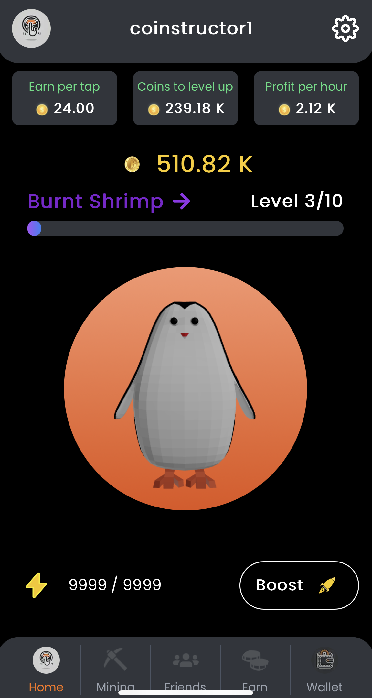
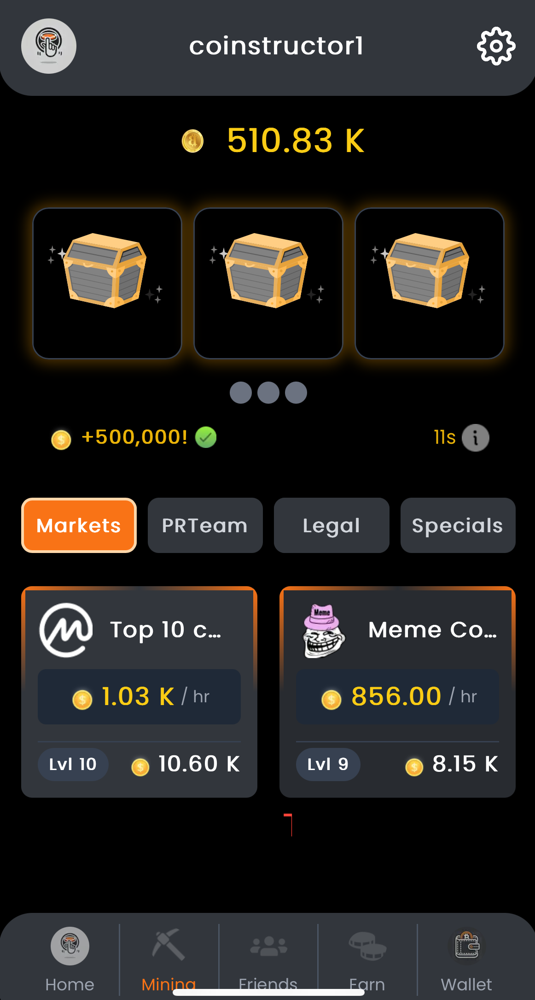
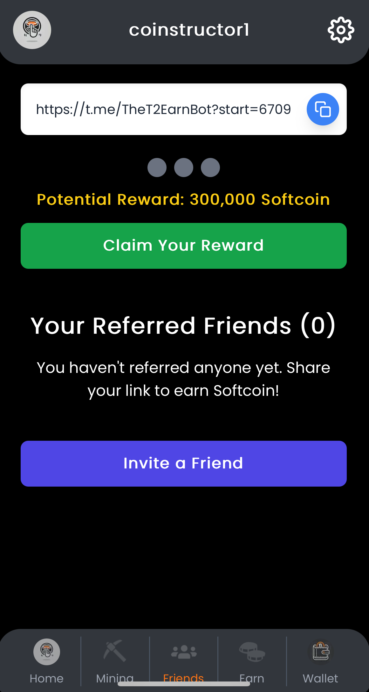
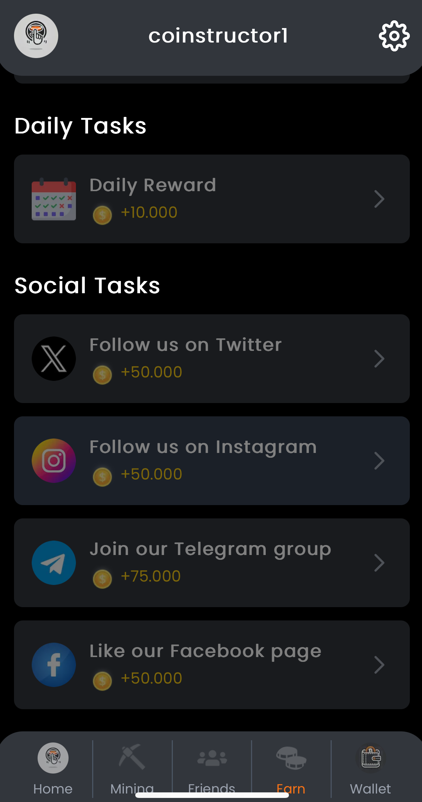
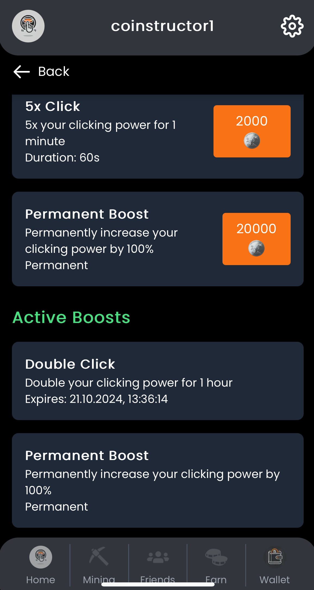

# Sample App

The Proof of Concept (PoC) app is a simple clicker game, similar to Hamster Combat, designed to showcase the capabilities of t:connect in a fun and interactive way. It demonstrates how blockchain interactions can be seamlessly integrated into a Telegram Mini App.


You can play the game in telegram via [@TheT2Earn](https://t.me/TheT2Earnbot)


## Game Features

### Main Button Clicking

* Action: Clicking on the main button.
* Effect: Increases the player's balance by a base amount.
* Description: Each click represents a basic action in the game, incrementing your balance.

<figure><figcaption>
home screen
</figcaption></figure>

### Mining Objects

* Action: Clicking on a mining object within the game.
* Effect: Increases the balance automatically every hour.
* Description: Mining objects act as passive income generators, adding to your balance over time without additional clicks.

<figure><figcaption>
mining screen
</figcaption></figure>

### Combos

* Action: Achieving certain click sequences or milestones.
* Effect: Provides a one-time significant increase to the balance.
* Description: Combos reward players for active engagement and skillful clicking patterns.

### Referral Links

* Action: Generating and sending a referral link to other Telegram users.
* Effect: Both the referrer and the new player receive a balance boost upon successful referral.
* Description: Encourages users to invite friends, expanding the game's user base organically.
* How to Use:
  * Click on the Referral button.
  * Send the link via Telegram to your contacts.

<figure><figcaption>
referral screen
</figcaption></figure>

### Earn Section

* Action: Clicking on items within the Earn section.
* Effect: Opens a link (e.g., an advertisement or partner site) and increases the balance once per item.
* Description: Provides opportunities to earn extra coins by engaging with sponsored content.

<figure><figcaption></figcaption></figure>

### Boost Menue

* Action: Spending balance to purchase boosts.
* Effect:
  * Temporary Boost: Multiplies the effect of the main button clicks by x2 up to 5x for 3600 seconds down to 60s.
  * Permanent Multiplier: Doubles (2x) the effect of main button clicks for the lifetime of the game.
* Description: Allows players to strategically enhance their earning potential through boosts.

<figure><figcaption>
boost section
</figcaption></figure>

## Game Flow

### Starting the Game



### Starting the Game

* Open the Mini App within Telegram via [@TheT2Earn](https://t.me/TheT2Earnbot)
* Click Open Game



### Increasing Balance

* Click the main button repeatedly to increase your balance
* Utilize mining objects for passive income



### Enhancing Earnings

* Purchase boosts from the the boosts-menu to multiply your earnings
* Engage in combos for instant balance increases



### Expanding the Game

* Invite friends with referral link
* Explore the Earn section for additional



### Spending Balance

* Use accumulated balance to buy more boosts
* Unlock new mining objects or game features



## Modals

In the game, modals are used to inform users about important events. For example, when a boost-item is purchased, a modal appears at the top of the screen confirming the action. Similarly, when a task in the "Earn" section is completed successfully, a larger modal provides detailed information about the current status of the action.

<figure><figcaption>
task completed modal in earn
</figcaption></figure>

 

<figure><figcaption>
boost-item purchased
</figcaption></figure>

